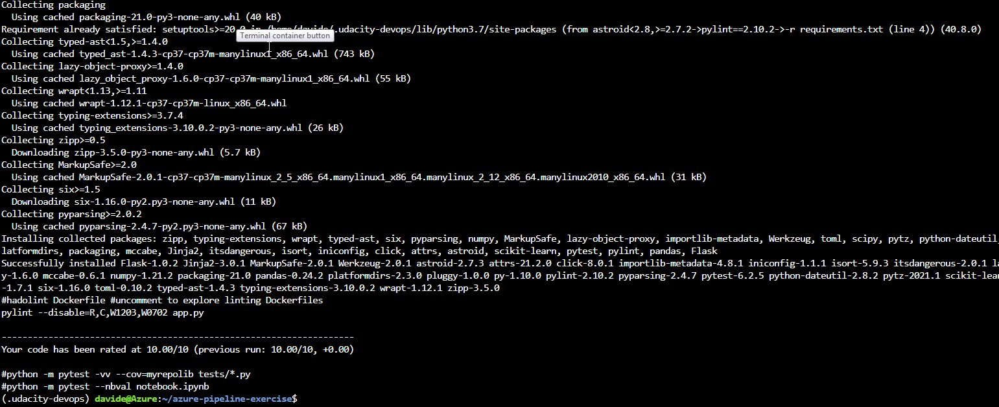
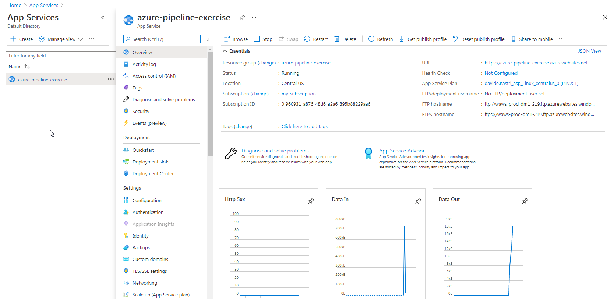
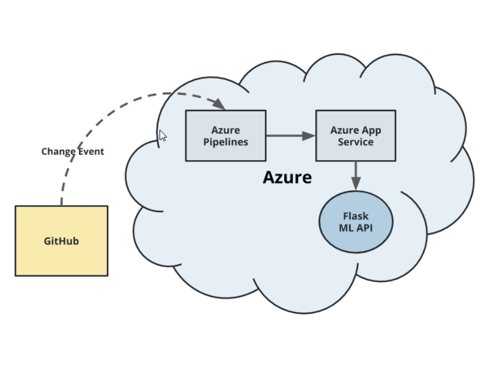

[](https://github.com/ltpitt/azure-pipeline-exercise/actions/workflows/python-app.yml)

# Overview

This repository contains a Python Web API (flask / scikit-learn) that is able to predict housing prices in Boston.
Included facilities allow to deploy the application in Azure Cloud Shell and deploy the application as an Azure App Service.
It features Continous Integration using GitHub Actions and Continous Deployment via a dedicated pipeline in Azure DevOps.

## Project Planning

* [The project's Trello board](https://trello.com/b/N9oJA84b/udacity-simple-board)
* [The project's management plan](project-management.xlsx)

## Instructions

### How to deploy the project using Azure Cloud Shell

Once in Azure Cloud Shell install the project and its requirements:
- ```git clone git@github.com:ltpitt/azure-pipeline-exercise.git```

- ```cd azure-pipeline-exercise```
- ```make setup```
- ```source ~/.udacity-devops/bin/activate```
- ```make all```


Then start the application locally:
```python app.py```

In order to test functionality open another Shell and:
```./make_prediction.sh```


### How to deploy the project using Azure App Service

The first step is creating an App Service in Azure, it is possible to use az cli tool from Azure Cloud Shell:
```az webapp up -n azure-pipeline-exercise -g azure-pipeline-exercise --sku S1```

Here's a screenshot of the App Service in Azure:


Now it is time to create the pipeline in Azure DevOps and lik it to this GitHub repo.


Continous Integration architectural diagram


Continous Delivery architectural diagram


<TODO:  Instructions for running the Python project.  How could a user with no context run this project without asking you for any help.  Include screenshots with explicit steps to create that work. Be sure to at least include the following screenshots:

* Project running on Azure App Service

* Project cloned into Azure Cloud Shell

* Passing tests that are displayed after running the `make all` command from the `Makefile`

* Output of a test run

* Successful deploy of the project in Azure Pipelines.  [Note the official documentation should be referred to and double checked as you setup CI/CD](https://docs.microsoft.com/en-us/azure/devops/pipelines/ecosystems/python-webapp?view=azure-devops).

* Running Azure App Service from Azure Pipelines automatic deployment

* Successful prediction from deployed flask app in Azure Cloud Shell.  [Use this file as a template for the deployed prediction](https://github.com/udacity/nd082-Azure-Cloud-DevOps-Starter-Code/blob/master/C2-AgileDevelopmentwithAzure/project/starter_files/flask-sklearn/make_predict_azure_app.sh).
The output should look similar to this:

```bash
udacity@Azure:~$ ./make_predict_azure_app.sh
Port: 443
{"prediction":[20.35373177134412]}
```

* Output of streamed log files from deployed application

> 

## Enhancements

<TODO: A short description of how to improve the project in the future>

## Demo 

<TODO: Add link Screencast on YouTube>


