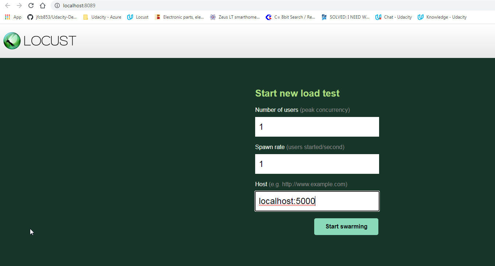
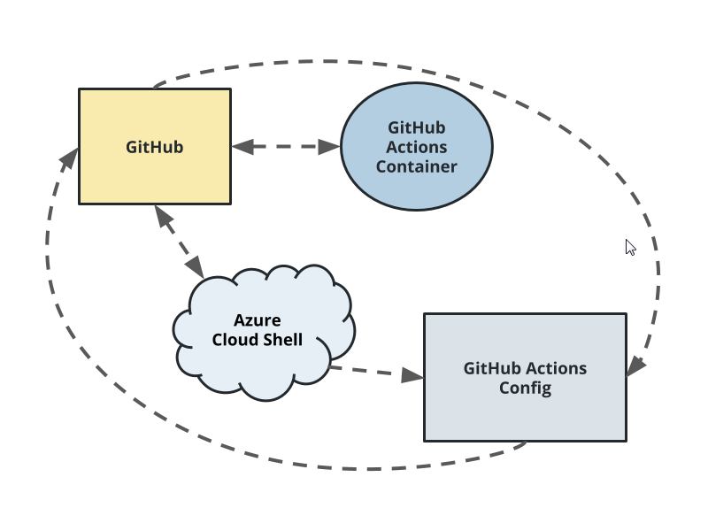

[](https://github.com/ltpitt/azure-pipeline-exercise/actions/workflows/python-app.yml)

# Overview

This repository contains a Python Web API (flask / scikit-learn) that is able to predict housing prices in Boston.
Included facilities allow to deploy the application in Azure Cloud Shell and deploy the application as an Azure App Service.
It features Continous Integration using GitHub Actions and Continous Deployment via a dedicated pipeline in Azure DevOps.

## Project Planning

* [The project's Trello board](https://trello.com/b/N9oJA84b/udacity-simple-board)
* [The project's management plan](project-management.xlsx)

## Instructions

### How to deploy the project using Azure Cloud Shell

Once in Azure Cloud Shell install the project and its requirements:  
- ```git clone git@github.com:ltpitt/azure-pipeline-exercise.git```  


- ```cd azure-pipeline-exercise```
- ```make setup```
- ```source ~/.udacity-devops/bin/activate```
- ```make all```  


Then start the application locally:  
```python app.py```

In order to test functionality open another Shell and:  
```./make_prediction.sh```  


### How to deploy the project using Azure App Service

The first step is creating an App Service in Azure, it is possible to use az cli tool from Azure Cloud Shell:  
```az webapp up -n azure-pipeline-exercise -g azure-pipeline-exercise --sku S1```

Here's a screenshot of the App Service in Azure:  


Now it is time to create the pipeline in Azure DevOps and lik it to this GitHub repo.

Here's a screenshot of a successful pipeline run:  


After the project is successfully deployed it is possible to test its functionality:  
```chmod +x make_predict_azure_app.sh && ./make_predict_azure_app.sh```  


It is possible to visit the application via browser:  


In order to check application logs:  
```az webapp log tail -g azure-pipeline-exercise -n azure-pipeline-exercise```  


## Stress test 

It is possible to stress test the application using Locust.
In order to run locust locally:  
```pip install locust```

And then:
```locust```

Once locust starts open your browser to http://localhost:8089 and fill the desired data like in the example below:  



The test will run and it will be possible to check its stats and download test data:


Continous Integration architectural diagram  



Continous Delivery architectural diagram  


## Enhancements

- Explore the possibility to use Docker images

## Demo 

<TODO: Add link Screencast on YouTube>


